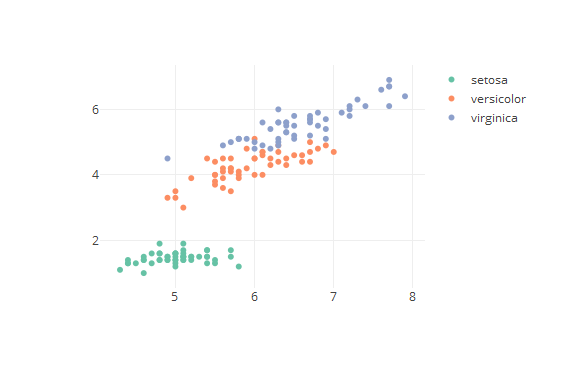

## What is the dataset viewer?

1. Select a dataset you want to view
2. Choose the properties you want to inspect
3. Look at the data in the plot tab
4. You change the variables on the fly to get a feel for the data

--- .class #id1 

## Why would you want to use it?

The plots can give you insight into the data set, for example you can the following plot for the iris data set:


```r
plot_ly(x = iris$Sepal.Length, y = iris$Petal.Length, 
    color = iris$Species, type = 'scatter',  mode = 'markers' )
```



--- .class #id2 

## How does it work

* If you select a dataset, the program will read which variables are present in the data set
* It fills the x-axis, y-axis and color dorpdown with the variable names 
* Evertime the used select a different variable to display the plot is recreated based on on the selected variables 
* It uses the Plotly library for plot, so you can zoom in and use other plotly options  

--- .class #id3

## What not and Thanks

### Ideas for the future
* Upload csv files directly
* More plot options
* Factor analysis and fitting procedures

### Thanks
Thanks for you attention, please feel free to contact me for questions and don't forget to use the dataset viewer


